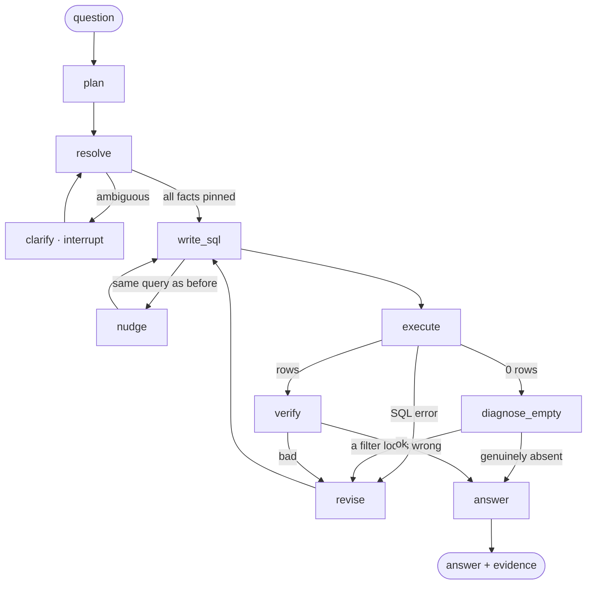

# glassbox — design

A data analyst agent that answers questions about a database, checks its own
answers, and shows its work.

---

## The idea

An LLM turns a question into SQL. That part is easy and everyone does it.

The hard part is that **nothing checks the answer.** A model can produce SQL that
runs perfectly, returns a clean number, and answers a different question than the
one asked. The user sees a confident number and no reason to doubt it.

glassbox is built around the checks. The agent resolves what it doesn't know
before writing SQL, verifies the result afterwards, diagnoses empty results
instead of reporting them, and streams every step to the browser.

**The whole design in one line:** the model decides *what to try*; code decides
*what happens next*.

---

## How a question flows



Nothing reaches `answer` by accident: it is reached verified, diagnosed, or out
of attempts — and the last two say so honestly rather than pretending.

### The nodes

| Node | Job | Status |
|---|---|---|
| `plan` | interpret the question; list facts still needed and who supplies each | planned |
| `resolve` | run cheap probes to pin values, ranges and spellings | planned |
| `clarify` | pause via `interrupt()` and ask the user — only when it changes the answer | planned |
| `write_sql` | one complete query, every filter a literal; runs the precheck | **built** |
| `nudge` | block a repeated query and force a new approach | **built** |
| `execute` | run it read-only, record the fingerprint | **built** |
| `diagnose_empty` | localize a zero result by progressive relaxation | **built** |
| `verify` | does this SQL genuinely answer this question? | **built** |
| `revise` | promote whatever `pending` holds into feedback and rewrite | **built** |
| `answer` | report the number, with assumptions and diagnosis stated | **built** |

**One way back.** Four different things can reject an attempt — a precheck, a
SQL error, an empty-result diagnosis, a verifier critique — but they all reach
`write_sql` through the single `revise` node. Whichever node detected the problem
leaves its explanation in `pending`; `revise` promotes it to `feedback` and
spends one of the three attempts. Adding a fifth kind of rejection means writing
a detector, not another edge.

Build order is at the end.

---

## What the agent knows about the data

Correct SQL is impossible against values you have never seen. The agent is given
its grounding in three tiers, cheapest first.

**Tier 1 — schema.** Every table, column and type, injected once (~500 tokens).
All 8 tables at once, because a model that sees the whole schema writes better
joins than one discovering it a table at a time.

**Tier 2 — value profiles.** Computed when the database is built, pasted into the
same text. Deterministic, no LLM call:

```
orders (3,000 rows)
  order_status VARCHAR    — delivered(2,730), shipped(120), canceled(90), processing(60)
  order_purchase_timestamp TIMESTAMP — 2017-01-01 … 2018-12-31
products (200 rows)
  product_category_name VARCHAR — 8 values: cama_mesa_banho, beleza_saude, moveis_decoracao, …
```

Rule: if `COUNT(DISTINCT) ≤ 25`, list the values; for dates and numbers, give
min/max. About 300 extra tokens, and it removes an entire class of failure.

> **Why this exists.** Asked for *"top 3 spending customers in the last few
> months"*, the agent filtered `>= current_date - INTERVAL 3 months`. The data
> ends in 2018. Zero rows, and it had no way to know. A date range in the profile
> makes that mistake unwritable.

**Tier 3 — on-demand resolution.** Thousands of cities can't be listed, so
high-cardinality values are resolved against the database when a question needs
one:

```sql
SELECT customer_city, customer_state, count(*) AS n
FROM customers
WHERE customer_city ILIKE '%' || ? || '%'
   OR jaro_winkler_similarity(customer_city, ?) > 0.85   -- catches typos
GROUP BY 1, 2 ORDER BY n DESC LIMIT 5;
```

The **counts** are what make it useful: one match → pin it silently; several →
ask the user; zero → the answer is already known before any real query exists.

**Tier 4 — the glossary.** Business terms with house definitions: revenue means
`order_items.price`, a sale means `order_status = 'delivered'`. Looked up, not
guessed, and not asked about either.

> **Why this exists.** Asked for *"total revenue from delivered orders"*, the
> agent summed `order_payments.payment_value` → 1,287,361.10 where the gold sums
> `order_items.price` → 1,202,737.26. The difference is freight. Both are
> defensible SQL; the disagreement is over what *revenue means*. Stating it in a
> prompt wasn't enough — the agent ignored it.

---

## Planning and asking

`plan` emits a contract, not prose — each missing fact named alongside **who
supplies it**:

```json
{
  "interpretation": "top 3 customers by total spend, last 3 months of available data",
  "facts_needed": [
    {"fact": "date range of orders", "source": "db",
     "probe": "SELECT max(order_purchase_timestamp) FROM orders"},
    {"fact": "city 'springfield'",   "source": "db",
     "probe": "SELECT customer_city, count(*) ... ILIKE '%springfield%'"},
    {"fact": "does spending include freight?", "source": "glossary"},
    {"fact": "which Springfield?",   "source": "user"}
  ],
  "assumptions": ["'delivered' orders only"]
}
```

Only `source: user` interrupts. `clarify` states facts rather than asking blind:

> Found 3 cities matching "springfield": Springfield MA (1,204 orders),
> Springfield IL (887), Springfield MO (12). Which one?

Answerable in one click instead of a conversation.

**The discipline that keeps this from being annoying:** only interrupt when the
answer would materially change *and* nothing else can settle it. Everything the
database or the glossary can settle is settled silently, with the assumption
stated in the final answer — *"assuming delivered orders only, excluding
freight."*

Once every fact is pinned, **one** complete query is written with all filters as
literal values. The model does its hardest work with zero unknowns, which is when
it is most reliable.

---

## Verification

Three layers, and the order matters — the cheapest and least fallible runs first.

**1. The database.** SQL that doesn't parse is rejected in milliseconds, and
DuckDB's error names the offending token. That message is fed back verbatim
rather than prettified, because it is the teaching signal.

**2. Deterministic checks.** Zero rows, a filter outside the data's real range, a
value that matches nothing — code can settle all of these, and code cannot
rationalize.

**3. The LLM verifier.** Last, for the part that needs judgment: does this query
answer *this* question? Given the glossary and the profiles, so it has a rulebook
rather than an opinion.

> **Why the order matters.** With only layer 3, the verifier returned **ok** on
> that empty result, reasoning: *"An empty result set may simply indicate no
> qualifying data, which is acceptable given the question."* Its prompt said to
> reject empty results. It talked itself out of the rule — which is what prompts
> do and code doesn't.

### Zero is ambiguous in both directions

A zero-row result means either *"no such data exists"* or *"my query is wrong"*,
and those are indistinguishable without a second check. Trusting a zero as an
answer is one failure; trusting it as proof of absence is the same failure one
step earlier.

`diagnose_empty` drops one filter at a time and watches where rows appear:

```
target:  city ILIKE '%springfield%' AND status='delivered' AND date >= 2026-05-01   → 0

  drop date        → 1,204 rows   ← the date filter is the culprit
  drop status      →     0
  drop city        →   312
  no filters       → 3,000
```

Three or four `count(*)` queries, milliseconds each. Compare what the user hears:

> ❌ "There is no data for that."
> ✅ "Springfield has 1,204 delivered orders, but none after 2018-12-31 — the data
> ends there. Here are the top 3 spenders in the last 3 months of available data
> instead."

The second is actionable, and only possible because the zero was diagnosed rather
than reported. Pure Python, no model call.

---

## Control flow

Every routing decision lives in a small function that reads state and returns the
next node's name. **No LLM output routes anything** — a model that has lost the
plot cannot talk its way past a router.

| Router | Condition | Next |
|---|---|---|
| `after_write` | SQL already tried, attempts left | `nudge` |
| | otherwise | `execute` |
| `after_execute` | rows returned | `verify` |
| | zero rows | `diagnose_empty` |
| | SQL error, attempts left | `revise` |
| | out of attempts | `answer` |
| `after_verify` | verdict ok **or** out of attempts | `answer` |
| | verdict bad, attempts left | `revise` |

This is the answer to "why a graph instead of a while loop." Each row is a line of
routing code, independently testable. In a loop they would be nested conditionals
sharing mutable flags.

**Every cycle is guarded.** `attempts` caps rewrites at 3; probes and clarifies
are capped the same way. The `nudge` path is a third guard: a repeated query is
never re-run, because the result is already known — the prompt is edited instead,
since the model call is the expensive part.

---

## State

Nodes never talk to each other. They read one dict and return partial updates.
How each update merges is declared on the field, not in the node:

| Field | Merge | Holds |
|---|---|---|
| `question` | overwrite | what was asked |
| `schema` | overwrite | tables, types, value profiles |
| `plan` / `resolved` | overwrite | interpretation, and facts pinned so far |
| `sql` | overwrite | the current attempt |
| `result` | overwrite | rows, or the error |
| `verdict` / `critique` | overwrite | `ok` / `bad`, and why |
| `feedback` | **append** | everything learned so far, fed to the next rewrite |
| `tried` | **append** | fingerprints of SQL already attempted |
| `attempts` | overwrite | the loop guard |
| `events` | **append** | what the UI renders |

The append fields carry the memory. `feedback` is why attempt 2 is smarter than
attempt 1; `tried` is why attempt 2 can't *be* attempt 1.

> **A trap worth knowing.** Fingerprints in `tried` are strings, not tuples.
> Checkpointers serialize state through msgpack, where a set of tuples comes back
> as `None` — silently. Anything you may checkpoint must survive serialization.

---

## A run, end to end

*"Which product category has the worst average review score?"*


Attempt 1 aliased a table `or`. DuckDB rejected it, the error went back verbatim,
attempt 2 renamed the alias. 4 LLM calls, ~1,620 in / ~1,545 out tokens, 28s on a
local model.

---

## Where things live

```
graph.py   the agent — nodes, routers, cycles          ← read this first
tools.py   read-only SQL, schema text, value profiles  ← the only path to data
db.py      DuckDB, real Olist CSVs or synthetic
config.py  which model runs which node
server.py  FastAPI + SSE; streams `events` to the browser
eval/      gold questions, scored on results not SQL text
```

Two boundaries hold the design together.

**All data access goes through `tools.py`.** Read-only connection, DDL and DML
rejected, results row-capped. The database is the oracle everything is graded
against, so the agent must not be able to change it. Permissions belong here too
when they come — a profile restricting visible tables and columns, applied to the
schema *before* the model sees it. The agent shouldn't be asked not to look; it
shouldn't be able to.

**Each node names a role, not a model** (`config.py`). `sql_writer`, `verifier`
and `answerer` resolve independently, so a frontier model can take the hard step
while a local one keeps the easy step — then measure whether it was worth it.

---

## Principles

1. **Rules you care about go in code.** A policy in a prompt is a suggestion.
2. **Never trust an unverified zero** — in either direction.
3. **Resolve before you generate.** The model is most reliable when nothing is
   unknown at the moment it writes SQL.
4. **Ask only when it changes the answer**, and state the facts while asking.
5. **Deterministic first, model second.** Anything code can know — value sets,
   date ranges, row counts — should be known before a model is consulted.

---

## Build order

| # | Change | Status |
|---|---|---|
| 1 | Value profiles in `schema_text()` (`profile_db.py`) | **done** |
| 2 | Deterministic precheck before running a query (`checks.py`) | **done** |
| 3 | `diagnose_empty` by progressive relaxation | **done** |
| 4 | Glossary, sent to writer *and* verifier | **done** |
| 5 | Gold questions 8 → 17 | **done** |
| 6 | `plan` + `resolve` | next — measure against the current number |
| 7 | `clarify` via `interrupt()` | needs UI work for pause/resume |
| 8 | Permissions enforced in `tools.py` | for a real deployment |
| 9 | Hybrid text + SQL over the 41% of reviews with comments | the "why" questions |

Measure every step against `eval/run_eval.py`. Current baseline: **7/8 (87.5%)**
execution accuracy, all three roles on local `gpt-oss:20b`.

One open question worth an experiment rather than an opinion: **does a plan step
actually help?** It should win on multi-join questions and may well *hurt* on
simple ones by overcomplicating a two-line query. Keep the current graph, build
the planned one, run the same gold set against both.

**Deferred deliberately:** surfacing the plan to the user — showing the
interpretation, assumptions and probes in the UI, and letting them correct it
before the query runs. Get the logic right first, then decide how it's presented.
