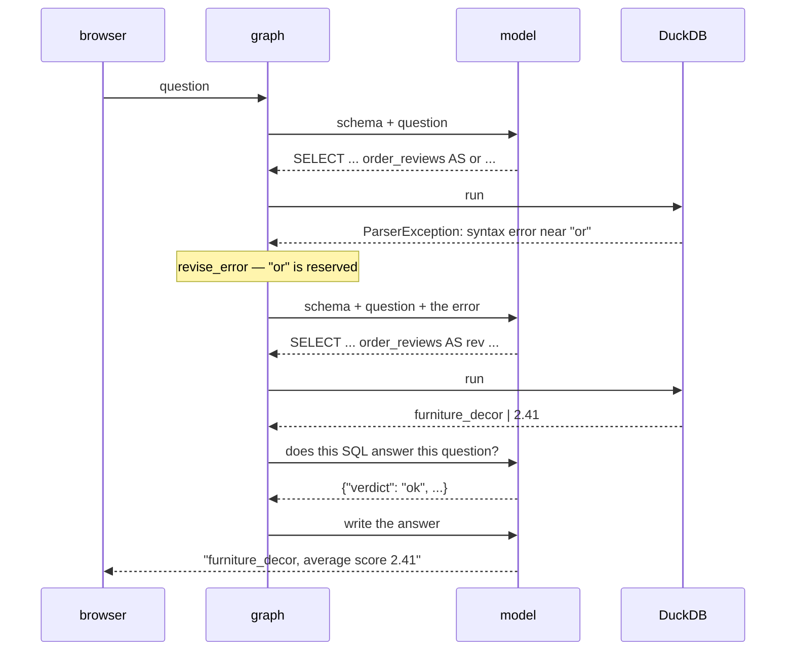
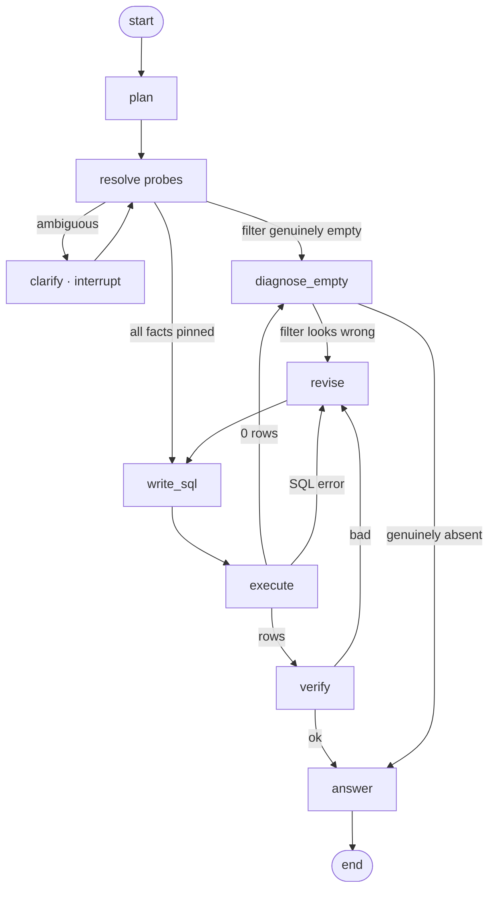

# glassbox — design

How the agent works today, and the architecture it's growing into.

Part 1 is what runs right now. Part 2 is designed but not built — kept separate
on purpose, so the doc never flatters the code.

---

## The idea

An LLM turns a question into SQL. That part is easy and everyone does it.

The hard part is that **nothing checks the answer.** A model can produce SQL that
runs perfectly, returns a clean number, and answers a different question than the
one asked. The user sees a confident number and no reason to doubt it.

glassbox puts checks in the loop and streams every step to the browser, so the
reasoning is visible instead of trusted.

**The whole design in one line:** the model decides *what to try*; code decides
*what happens next*.

---

# Part 1 — what runs today

## The graph


Five working nodes and two repair nodes. Three ways to reach `answer`: verified,
out of attempts after errors, or out of attempts after rejections — the last two
answer honestly rather than pretending.

**Two cycles**, and every cycle is a place a program can hang forever:

| Cycle | Trigger | Repair |
|---|---|---|
| `execute → revise_error → write_sql` | DuckDB rejected the SQL | feed the database's own error message back |
| `verify → revise_critique → write_sql` | SQL ran, result is wrong | feed the verifier's critique back |

Both are capped by `attempts` (max 3, `graph.py:27`). The `nudge` path is a third
guard: if the model regenerates SQL it has already tried, the query is not run
again — the prompt is edited instead, because re-running known SQL teaches
nothing while the model call is the expensive part.

## State: the shared whiteboard

Nodes never talk to each other. They read one dict and return partial updates to
it (`graph.py:35`). How each update merges is declared on the field, not in the
node:

| Field | Merge | Holds |
|---|---|---|
| `question` | overwrite | what was asked |
| `schema` | overwrite | all 8 tables, injected once |
| `sql` | overwrite | the current attempt |
| `result` | overwrite | rows, or the error |
| `verdict` / `critique` | overwrite | `ok` / `bad`, and why |
| `feedback` | **append** | everything learned so far, fed to the next rewrite |
| `tried` | **append** | fingerprints of SQL already attempted |
| `attempts` | overwrite | the loop guard |
| `events` | **append** | what the UI renders |

The two append fields carry the memory. `feedback` is why attempt 2 is smarter
than attempt 1; `tried` is why attempt 2 can't *be* attempt 1.

> **A trap worth knowing.** Fingerprints in `tried` are strings, not tuples.
> Checkpointers serialize state through msgpack, where a set of tuples comes back
> as `None` — silently. Anything you may checkpoint must survive serialization.

## One question, end to end

Real run. *"Which product category has the worst average review score?"*



Attempt 1 aliased a table `or` — a reserved word. DuckDB rejected it, the error
went back verbatim, and attempt 2 renamed the alias. **The error message is the
teaching signal**, which is why `tools.py` returns it raw instead of prettifying
it. Cost: 4 LLM calls, ~1,620 in / ~1,545 out tokens, 28s locally.

## The routers

All control flow lives in three small functions (`graph.py:196–214`). No LLM
output routes anything — a model that has lost the plot cannot talk its way past
these.

| Router | Condition | Next |
|---|---|---|
| `after_write` | SQL already tried, attempts left | `nudge` |
| | otherwise | `execute` |
| `after_execute` | result ok | `verify` |
| | error, attempts left | `revise_error` |
| | error, out of attempts | `answer` |
| `after_verify` | verdict ok **or** out of attempts | `answer` |
| | verdict bad, attempts left | `revise_critique` |

This is the answer to "why a graph instead of a while loop." Each row above is a
line of routing code. In a loop they would be nested conditionals sharing mutable
flags; here each is independent and separately testable.

## Where things live

```
graph.py   the agent — nodes, routers, cycles          ← read this first
tools.py   read-only SQL + schema text                 ← the only path to data
db.py      DuckDB, real Olist CSVs or synthetic
config.py  which model runs which node
server.py  FastAPI + SSE; streams `events` to the browser
eval/      gold questions, scored on results not SQL text
```

Two boundaries hold the design together:

**All data access goes through `tools.py`.** Read-only connection, DDL and DML
rejected, results row-capped. The database is the oracle everything is graded
against, so the agent must not be able to change it. Permissions belong here too,
when they come — enforced in code, never requested in a prompt.

**Each node names a role, not a model** (`config.py`). `sql_writer`, `verifier`,
and `answerer` resolve independently, so you can put a frontier model on the hard
step and keep a local one on the easy step, then measure whether it was worth it.

## Two holes, both real

Found by running it, not by reading it.

**1. The verifier accepts empty results.** Asked for *"top 3 spending customers in
the last few months"*, the agent filtered `>= current_date - INTERVAL 3 months`.
The data ends in 2018. Zero rows. The verifier returned **ok**:

> *"An empty result set may simply indicate no qualifying data, which is
> acceptable given the question."*

Its prompt explicitly says to reject empty results when data should exist. It
rationalized past that, because it has no idea what date range the data covers.

**2. The verifier accepts a wrong definition.** Asked for *"total revenue from
delivered orders"*, the agent summed `order_payments.payment_value` →
1,287,361.10. The gold sums `order_items.price` → 1,202,737.26. The difference is
freight. The system prompt states the house definition; the agent ignored it, and
the verifier — seeing only question, SQL, and result — had no rulebook to check
against.

Same root cause both times: **a verifier that cannot see the rules cannot enforce
them.** It is an opinion, not an audit.

---

# Part 2 — the designed architecture

*Not built yet. This is the plan.*

## The core problem: the agent is blind to its own data

Today the prompt contains the schema — every table, column and type — and nothing
else. So the agent knows `order_status` exists. It does **not** know the values
are `delivered`/`shipped`/`canceled`, that category names are Portuguese, or that
the data stops on 2018-12-31.

Both holes above are that blindness. You cannot write a correct filter against
values you have never seen.

*(`tools.py` has a `distinct_values()` helper that the graph never calls — dead
code, and a fair symbol of the gap.)*

## Fix 1 — static value profiles

Most of this needs no agent at all. Compute it once when the database is built,
and paste it into the schema text:

```
orders (3,000 rows)
  order_status VARCHAR    — delivered(2,730), shipped(120), canceled(90), processing(60)
  order_purchase_timestamp TIMESTAMP — 2017-01-01 … 2018-12-31
products (200 rows)
  product_category_name VARCHAR — 8 values: cama_mesa_banho, beleza_saude, moveis_decoracao, …
```

Rule: if `COUNT(DISTINCT) ≤ 25`, list the values; for dates and numbers, give
min/max. Deterministic, zero LLM calls, ~300 extra tokens, and it removes a whole
class of failure. **Do this before anything clever.**

## Fix 2 — plan, then resolve, then ask

High-cardinality columns can't be enumerated — there may be thousands of cities.
Those get resolved on demand instead, and only then does the real query get
written.

The plan node's output is not prose. It's a contract naming each missing fact and
**who fills it**:

```json
{
  "interpretation": "top 3 customers by total spend, last 3 months of available data",
  "facts_needed": [
    {"fact": "date range of orders", "source": "db",
     "probe": "SELECT max(order_purchase_timestamp) FROM orders"},
    {"fact": "city 'springfield'",   "source": "db",
     "probe": "SELECT customer_city, count(*) ... ILIKE '%springfield%'"},
    {"fact": "does spending include freight?", "source": "glossary"},
    {"fact": "which Springfield?",   "source": "user"}
  ],
  "assumptions": ["'delivered' orders only"]
}
```

Three sources, three resolutions — DB probe, glossary lookup, ask the user. Only
the last one interrupts.

**Resolving a fuzzy value** uses the database, not the prompt:

```sql
SELECT customer_city, customer_state, count(*) AS n
FROM customers
WHERE customer_city ILIKE '%' || ? || '%'
   OR jaro_winkler_similarity(customer_city, ?) > 0.85   -- catches typos
GROUP BY 1, 2 ORDER BY n DESC LIMIT 5;
```

The **counts** are what make it useful: one match → pin it silently; several →
that's the clarify payload; zero → you already know before writing anything.

**Asking the user** is `interrupt()` — the graph pauses, the payload goes to the
UI, and a checkpointer resumes it exactly where it stopped. The payload states
facts rather than asking blind:

> Found 3 cities matching "springfield": Springfield MA (1,204 orders),
> Springfield IL (887), Springfield MO (12). Which one?

Answerable in one click instead of a conversation.

**The discipline that keeps this from being annoying:** only interrupt when the
answer would materially change the result *and* it can't be resolved otherwise.
Anything the DB can settle (one city matches) or a glossary can settle ("revenue
= `order_items.price`") is resolved silently, with the assumption stated in the
final answer — *"assuming delivered orders only, excluding freight."* That is
also the better fix for hole #2: a glossary entry, not a question.

Once every fact is pinned, **one** complete query gets written with all filters
as literal values. The model does its hardest work with zero unknowns, which is
when it is most reliable.

## Fix 3 — zero is ambiguous in both directions

A zero-row result means either *"no such data exists"* or *"my query is wrong"*,
and those are indistinguishable without a second check. Both mistakes are live:

- accepting zero as a valid **answer** — hole #1, already observed
- accepting zero as valid **evidence of absence** — early-exiting on a probe that
  was itself wrong, which just moves the confident wrong answer one node earlier

The fix is **progressive relaxation**: drop one filter at a time and watch where
rows appear.

```
target:  city ILIKE '%springfield%' AND status='delivered' AND date >= 2026-05-01   → 0

  drop date        → 1,204 rows   ← the date filter is the culprit
  drop status      →     0
  drop city        →   312
  no filters       → 3,000
```

Three or four `count(*)` queries, milliseconds each, and the emptiness is
localized. Compare what the user then hears:

> ❌ "There is no data for that."
> ✅ "Springfield has 1,204 delivered orders, but none after 2018-12-31 — the data
> ends there. Here are the top 3 spenders in the last 3 months of available data
> instead."

The second is actionable, and only possible *because* the zero was diagnosed
rather than reported.

This node is pure Python — no model call. It cannot rationalize its way to *"an
empty result is acceptable given the question"* the way the verifier did. That is
exactly why it must be code.

## The target graph



## Principles that fell out

1. **Rules you actually care about go in code.** A policy in a prompt is a
   suggestion; the revenue bug is what that costs. Routers, pre-checks and
   relaxation ladders are enforcement.
2. **Never trust an unverified zero** — in either direction.
3. **Resolve before you generate.** The model is most reliable when nothing is
   unknown at the moment it writes SQL.
4. **Ask only when it changes the answer**, and state the facts while asking.
5. **Deterministic first, model second.** Everything code can know — value sets,
   date ranges, row counts — should be known before a model is consulted.

---

## Build order

| # | Change | Why it's first |
|---|---|---|
| 1 | Static value profiles in `schema_text()` | ~1 hour, no new nodes, kills a whole failure class |
| 2 | Deterministic pre-checks before the LLM verifier | converts both known holes into caught failures |
| 3 | `diagnose_empty` with progressive relaxation | turns dead ends into useful answers |
| 4 | Glossary of business terms | fixes hole #2 without nagging the user |
| 5 | `plan` + `resolve` nodes | the real architecture shift; measure against 1–4 |
| 6 | `clarify` via `interrupt()` | last — needs UI work for pause/resume |
| 7 | More gold questions (8 → 20) | makes the number trustworthy |

Measure every step against `eval/run_eval.py`. Baseline to beat: **7/8 (87.5%)**,
all three roles on local `gpt-oss:20b`.

One open question worth an experiment rather than an opinion: **does a plan step
actually help?** It should win on multi-join questions and may well *hurt* on
simple ones by overcomplicating a two-line query. Keep v1, build v2 with `plan`,
run the same gold set against both.

## Later

**Surface the plan to the user.** Everything above happens invisibly — the
interpretation, the assumptions, the probes, the relaxation ladder. Showing that
reasoning in the UI, and letting the user correct it *before* the query runs, is
the natural next product step. Deferred deliberately: get the logic right first,
then decide how it's presented.
