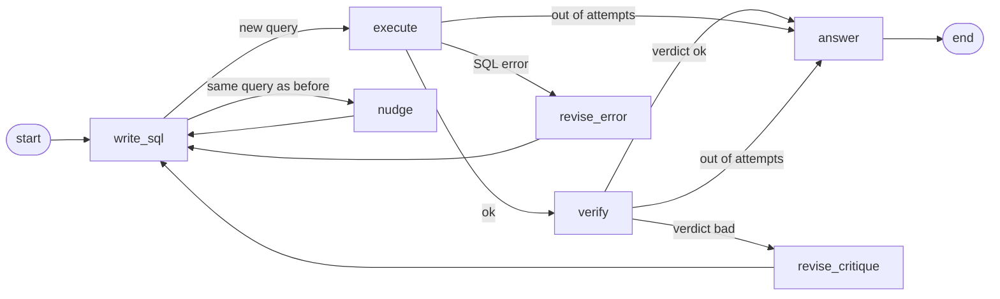
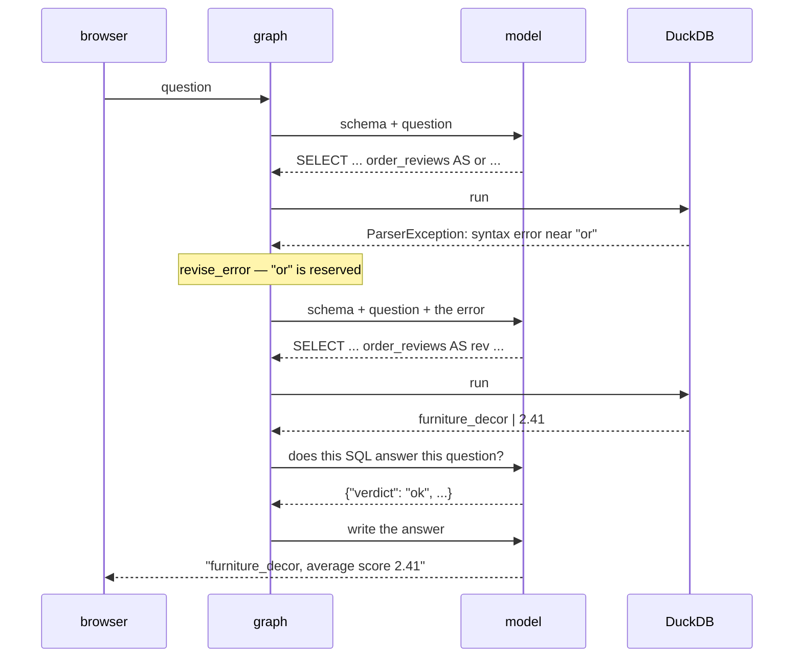

# glassbox — design

How `graph.py` works, in one sitting. Read this, then the file.

---

## The idea

An LLM turns a question into SQL. That part is easy and everyone does it.

The hard part is that **nothing checks the answer.** A model can produce SQL
that runs perfectly, returns a clean number, and answers a different question
than the one asked. The user sees a confident number and no reason to doubt it.

glassbox puts a check in the loop. The agent writes SQL, runs it, examines its
own result, and rewrites when the check fails — up to three times. Every step is
streamed to the browser, so you can see the reasoning instead of trusting it.

**The whole design in one line:** the model decides *what to try*; code decides
*what happens next*.

---

## The graph



Five working nodes and two repair nodes. Three ways to reach `answer`: verified,
out of attempts after errors, or out of attempts after rejections — the last two
answer honestly rather than pretending.

**Two cycles**, and every cycle is a place a program can hang forever:

| Cycle | Trigger | Repair |
|---|---|---|
| `execute → revise_error → write_sql` | DuckDB rejected the SQL | feed the database's own error message back |
| `verify → revise_critique → write_sql` | SQL ran, result is wrong | feed the verifier's critique back |

Both are capped by `attempts` (max 3, `graph.py:27`). The `nudge` path is a third
guard: if the model regenerates SQL it has already tried, the query is not run
again — the prompt is edited instead.

---

## State: the shared whiteboard

Nodes never talk to each other. They read one dict and return partial updates to
it (`graph.py:35`). How each update merges is declared on the field, not in the
node:

| Field | Merge | Holds |
|---|---|---|
| `question` | overwrite | what was asked |
| `schema` | overwrite | all 8 tables, injected once |
| `sql` | overwrite | the current attempt |
| `result` | overwrite | rows, or the error |
| `verdict` / `critique` | overwrite | `ok` / `bad`, and why |
| `feedback` | **append** | everything learned so far, fed to the next rewrite |
| `tried` | **append** | fingerprints of SQL already attempted |
| `attempts` | overwrite | the loop guard |
| `events` | **append** | what the UI renders |

The two append fields carry the memory. `feedback` is why attempt 2 is smarter
than attempt 1; `tried` is why attempt 2 can't *be* attempt 1.

> **A trap worth knowing.** Fingerprints in `tried` are strings, not tuples.
> Checkpointers serialize state through msgpack, where a set of tuples comes
> back as `None` — silently. Anything you may checkpoint must survive
> serialization.

---

## One question, end to end

Real run. *"Which product category has the worst average review score?"*



Attempt 1 aliased a table `or` — a reserved word. DuckDB rejected it, the error
went back verbatim, and attempt 2 renamed the alias. **The error message is the
teaching signal**, which is why `tools.py` returns it raw instead of prettifying
it. Cost: 4 LLM calls, ~1,620 in / ~1,545 out tokens, 28s locally.

---

## The routers

All control flow lives in three small functions (`graph.py:196–214`). No LLM
output routes anything — a model that has lost the plot cannot talk its way past
these.

| Router | Condition | Next |
|---|---|---|
| `after_write` | SQL already tried, attempts left | `nudge` |
| | otherwise | `execute` |
| `after_execute` | result ok | `verify` |
| | error, attempts left | `revise_error` |
| | error, out of attempts | `answer` |
| `after_verify` | verdict ok **or** out of attempts | `answer` |
| | verdict bad, attempts left | `revise_critique` |

This is the answer to "why a graph instead of a while loop." Each row above is a
line of routing code. In a loop they would be nested conditionals sharing
mutable flags; here each is independent and separately testable.

---

## Where things live

```
graph.py   the agent — nodes, routers, cycles          ← read this first
tools.py   read-only SQL + schema text                 ← the only path to data
db.py      DuckDB, real Olist CSVs or synthetic
config.py  which model runs which node
server.py  FastAPI + SSE; streams `events` to the browser
eval/      gold questions, scored on results not SQL text
```

Two boundaries hold the design together:

**All data access goes through `tools.py`.** Read-only connection, DDL and DML
rejected, results row-capped. The database is the oracle everything is graded
against, so the agent must not be able to change it. Permissions belong here
too, when they come — enforced in code, never requested in a prompt.

**Each node names a role, not a model** (`config.py`). `sql_writer`,
`verifier`, and `answerer` resolve independently, so you can put a frontier
model on the hard step and keep a local one on the easy step, then measure
whether it was worth it.

---

## Two holes, both real

Found by running it, not by reading it.

**1. The verifier accepts empty results.**
Asked for *"top 3 spending customers in the last few months"*, the agent filtered
`>= current_date - INTERVAL 3 months`. The data ends in 2018. Zero rows. The
verifier returned **ok**:

> *"An empty result set may simply indicate no qualifying data, which is
> acceptable given the question."*

Its prompt explicitly says to reject empty results when data should exist. It
rationalized past that, because it has no idea what date range the data covers.

**2. The verifier accepts a wrong definition.**
Asked for *"total revenue from delivered orders"*, the agent summed
`order_payments.payment_value` → 1,287,361.10. The gold sums
`order_items.price` → 1,202,737.26. The difference is freight. The system prompt
states the house definition; the agent ignored it, and the verifier — seeing only
question, SQL, and result — had no rulebook to check against.

Same root cause both times: **a verifier that cannot see the rules cannot enforce
them.** It is an opinion, not an audit.

---

## Where this goes next

1. **Deterministic pre-checks before the LLM verifier.** Zero rows → `bad`
   automatically. Date filter outside the data's real range → `bad`, with the
   actual range in the feedback. Code doesn't rationalize. Fixes both holes
   above and is roughly an hour of work.
2. **Ground the verifier.** Give it the data's date span, row counts, and a
   glossary of business terms. Let it run its own probe query — that turns
   verification from one opinion into an investigation.
3. **Permissions.** A profile per request restricting visible tables and
   columns, enforced in `tools.py`, with the schema filtered *before* the model
   sees it. The agent shouldn't be asked not to look; it shouldn't be able to.
4. **More gold questions.** Eight proves the harness works. Twenty with window
   functions and date math makes the number trustworthy.

Measure each against `eval/run_eval.py`. The baseline to beat is **7/8 (87.5%)**,
all three roles on local `gpt-oss:20b`.
